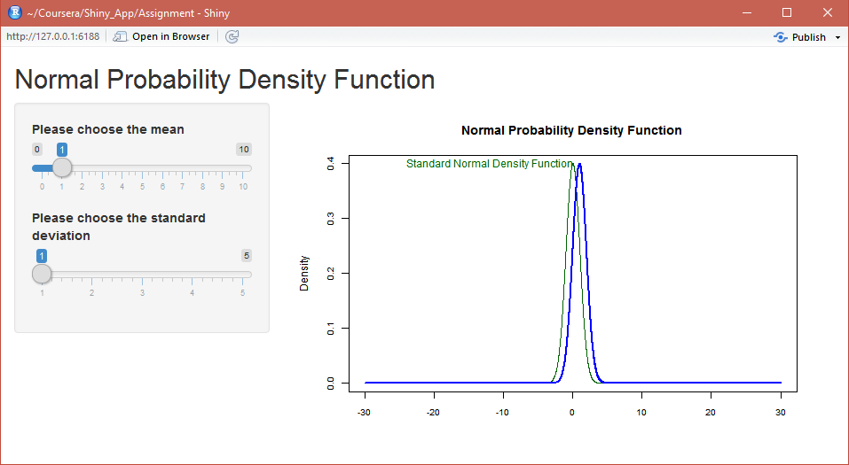
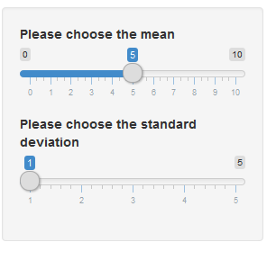
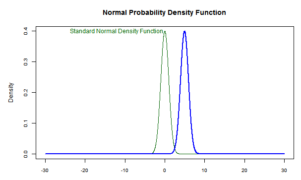

Reproducible Pitch Presentation
========================================================
author: PF
date: May 26 2017
autosize: true

My Shiny App
========================================================

My app contains an interactive graph that shows the
probability density function of a normally distributed
sequence of numbers.



Data
========================================================

The app assigns a normal distribution to a sequence of numbers
that starts at -30 and ends at 30 with steps of 0.01:


```r
xseq <- seq(-30,30,0.01)
ds <- dnorm(xseq, 0, 1)
```


How to use App (1)
========================================================

You can move the two sliders displayed in the sidebar. If you move the sliders, you
change the mean and standard deviation used to compute the normal probability density
function. A change in the mean moves the density function to the left or right. A change
in the standard deviation expands or narrows the bell shape.



How to use App (2)
========================================================

The plot in the main panel shows how changes in the mean and standard deviation change the probability density function. The plot also shows the standard normal distribution for
comparison.


